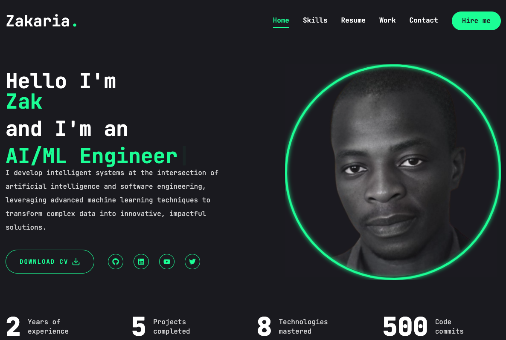

# 🚀 Modern Portfolio Website



[](https://codemon.io)
[](https://www.typescriptlang.org/)
[](https://nextjs.org/)
[](https://tailwindcss.com/)


> A cutting-edge portfolio website showcasing professional work through modern design and seamless interactions.

## ✨ Key Features

- **Responsive Design** - Pixel-perfect layouts across all devices and screen sizes
- **Dynamic Animations** - Engaging user experience with Framer Motion transitions
- **Interactive Components** - Rich interactions including:
    - Typewriter effect for skill highlights
    - Animated stat counters
    - Smooth page transitions
    - Hover effects on project cards
- **Professional Contact** - EmailJS integration for reliable communication
- **Performance Optimized** - Lightning-fast load times and optimal Core Web Vitals

## 🛠️ Tech Stack

### Frontend
- **Next.js** - React framework for production
- **TypeScript** - Static typing for robust code
- **Tailwind CSS** - Utility-first styling
- **Framer Motion** - Animation library
- **React Icons** - Modern icon components

### Tools & Services
- **EmailJS** - Email service integration
- **Git** - Version control
- **Vercel** - Deployment and hosting

## 🎯 Core Sections

1. **Hero Section**
    - Professional introduction
    - Dynamic role presentation
    - Call-to-action buttons

2. **Projects Showcase**
    - Featured work display
    - Project filtering
    - Detailed case studies

3. **Skills & Expertise**
    - Technical capabilities
    - Tools & technologies
    - Professional experience

4. **Professional Timeline**
    - Career milestones
    - Educational background
    - Achievements

5. **Contact Section**
    - Email contact form
    - Social media links
    - Resume download option

## 📱 Responsive Design

The website is fully responsively across:
- Desktop (1200px+)
- Laptop (1024px)
- Tablet (768px)
- Mobile (320px+)

## 📖 Project Structure

```
portfolio/
├── app/
│   ├── contact/
│   ├── fonts/
│   ├── hooks/
│   ├── resume/
│   ├── skills/
│   ├── work/
│   ├── globals.css
│   ├── layout.jsx
│   └── page.jsx
├── components/
│   ├── ui/
│   └── ...
├── lib/
├── public/
│   ├── assets/
│   └── resume/
└── ....
```

## 📫 Contact

For questions or feedback, reach out through:
- Website: [codemon.io](https://codemon.io)
- Email: [your@email.com](mailto:zcoulibalyeng@gmail.com)
- LinkedIn: [Your LinkedIn](https://linkedin.com/in/codemon)


## 💡 Future Enhancements

- [ ] Add a blog section

## 📄 License

This project is licensed under the MIT License—see the [LICENSE](LICENSE) file for details.

## 🙏 Acknowledgments

- All the amazing open-source projects that made this possible
- The developer community for continuous inspiration
- [Font Awesome](https://fontawesome.com) for icons
- [Unsplash](https://unsplash.com) for images

---

<div align="center">
Made with ❤️ by [Your Name]

⭐️ If you like this project, give it a star on GitHub! ⭐️
</div>
