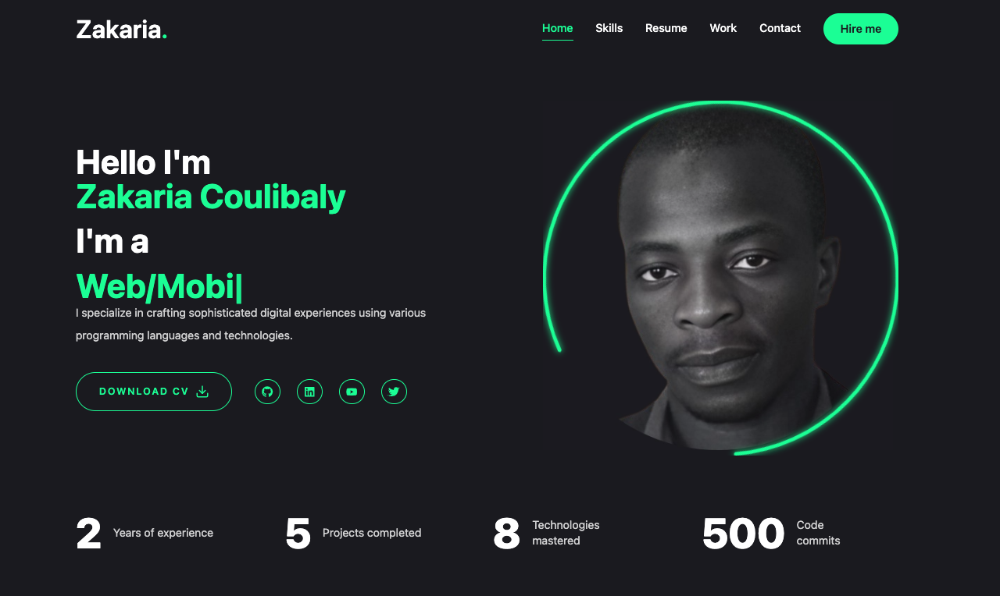

# **Project Title: Portfolio Website**

 

A modern, responsive portfolio website built with cutting-edge technologies. This website showcases a clean design with advanced animations, seamless user experience, and integration with EmailJS for contact forms. It's designed to display projects, skills, and personal information in a professional format.

## **Live Demo**

You can view the live demo of the project here: [Website](https://codemon.io)

## **Technologies Used**

- **Next.js**: React framework for server-rendered and static websites.
- **TypeScript**: Ensures type safety throughout the project.
- **Tailwind CSS**: A utility-first CSS framework for fast styling.
- **Framer Motion**: For animations and motion in React.
- **EmailJS**: To handle form submissions via email.
- **React Icons**: For rich, modern icons in the UI.

---

## **Features**

- **Responsive Design**: Fully mobile-optimized and responsive layout.
- **Typewriter Effect**: Animated typing effect for highlighting roles and skills.
- **Contact Form**: Integrated with EmailJS for email delivery.
- **Real-Time Stats**: Animated stat counters to display relevant statistics.
- **Social Links**: Easily accessible links to social media profiles.
- **Downloadable Resume**: Users can download a professional resume.
- **Animated Transitions**: Smooth transitions powered by Framer Motion.

---
